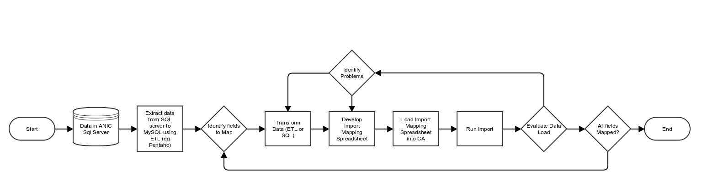
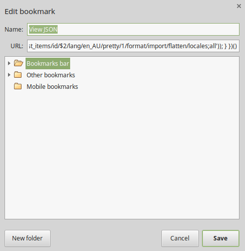

CSIRO NRCA Data Migration Tool
==============================

A CLI application using Symfony's [Console](https://github.com/symfony/Console) component.

Background Information
----------------------
[CollectiveAccess](https://github.com/collectiveaccess/providence) is an open source Collection Management System. It has
a built in Data Importer which is [extensively documented on the CA project wiki](http://docs.collectiveaccess.org/wiki/Data_Importer).
An evaluation of data import options was performed:

1) [Suitability of ETL Processes and tools developed in pilot project](https://confluence.csiro.au/display/CMS/Suitability+of+ETL+Processes+and+tools+developed+in+pilot+project)
2) [Providence data import options](https://confluence.csiro.au/display/CMS/Providence+data+import+options)

This data migration tool (https://bitbucket.csiro.au/projects/CMS/repos/data-migration/) is the result of the above reviews and
is evolving to meet the needs of the project.

Running the migrate command
---------------------------
```
$ bin/migrate
migrate 0.2.0

Usage:
  command [options] [arguments]

Options:
  -h, --help            Display this help message
  -q, --quiet           Do not output any message
  -V, --version         Display this application version
      --ansi            Force ANSI output
      --no-ansi         Disable ANSI output
  -n, --no-interaction  Do not ask any interactive question
  -v|vv|vvv, --verbose  Increase the verbosity of messages: 1 for normal output, 2 for more verbose output and 3 for debug

Available commands:
  all                                     Run ALL the migrations (kitchen sink). Commands are: sql:backup, profile:install, search:engine, collectionTwo:all, collectionOne:all, search:engine, search:reindex, sql:backup.
  help                                    Displays help for a command
  list                                    Lists commands
 all
  all:sample                              Import sample data for all migrations. Commands are: collectionOne:refresh, collectionTwo:refresh, search:engine, validate:sample, validate:sample, sql:backup, profile:install, demo:users, validate:sample, search:engine, search:reindex, sql:backup.
 demo
  demo:users                              Create demo users for all the configured roles in the system. Users will have a user name matching the role name.
  demo:users-lock                         Locks demo user accounts by invalidating their passwords. These passwords can subsequently be set either through the UI or the caUtils command.
  demo:users-unlock                       💀💀💀 Unlocks demo user accounts by setting their password to 'password'.💀💀💀 WARNING - insecure and should only be run on development machines.
 collectionTwo
  collectionTwo:all                                Run all the CollectionTwo migrations. Commands are: collectionTwo:refresh, import:bulk_all.
  collectionTwo:collecting_event_view              Create collecting event view from which to pull data.
  collectionTwo:collecting_team_view               Create collecting team view from which to pull data.
  collectionTwo:collection_unit_view               Create collection unit view from which to pull data.
  collectionTwo:create                             Create CollectionTwo data schema.
  collectionTwo:extract                            Extract CollectionTwo data.
  collectionTwo:identification_view                Create identification view from which to pull data.
  collectionTwo:location_view                      Create location view from which to pull data.
  collectionTwo:refresh                            Refresh data for the CollectionTwo migrations. Commands are: collectionTwo:create, collectionTwo:extract, collectionTwo:report, collectionTwo:transform.
  collectionTwo:report                             Create CollectionTwo data report.
  collectionTwo:taxon_view                         Create taxon view from which to pull data.
  collectionTwo:transform                          Run all the CollectionTwo transformations. Commands are: collectionTwo:location_view, collectionTwo:collecting_event_view, collectionTwo:collection_unit_view, collectionTwo:collecting_team_view, collectionTwo:taxon_view, collectionTwo:identification_view.
 collectionOne
  collectionOne:all                                Run all the CollectionTwo migrations. Commands are: collectionOne:refresh, import:bulk_all.
  collectionOne:collecting_event_view              Create collecting event view from which to pull data.
  collectionOne:collecting_team_view               Create collecting team view from which to pull data.
  collectionOne:collection_item_relationship_view  Create collection item relationship view from which to pull data.
  collectionOne:collection_item_view               Create collection item view from which to pull data.
  collectionOne:collection_unit_view               Create collection unit view from which to pull data.
  collectionOne:create                             Create CollectionTwo data schema.
  collectionOne:extract                            Extract CollectionTwo data.
  collectionOne:identification_view                Create identification view from which to pull data.
  collectionOne:item_identification_view           Create Item Identification view from which to pull data.
  collectionOne:linked_identifier_view             Create linked identifier view from which to pull data.
  collectionOne:refresh                            Refresh data for the CollectionTwo migrations. Commands are: collectionOne:create, collectionOne:extract, collectionOne:report, collectionOne:transform.
  collectionOne:report                             Create CollectionTwo data report.
  collectionOne:taxon_view                         Create taxon view from which to pull data.
  collectionOne:transform                          Run all the CollectionTwo transformations. Commands are: collectionOne:collecting_team_view, collectionOne:collecting_event_view, collectionOne:collection_unit_view, collectionOne:taxon_view, collectionOne:identification_view, collectionOne:collection_item_view, collectionOne:linked_identifier_view, collectionOne:linked_identifier_view, collectionOne:item_identification_view, collectionOne:collection_item_relationship_view.
 import
  import:bulk_all                         Download, import and run all mappings for a collection.
  import:bulk_run                         Run an import task for multiple mappings.
  import:run                              run the import using a mapping file, into CA.
 mapping
  mapping:bulk_import                     Run an import task for multiple mappings.
  mapping:download                        Download mapping file from Google Drive
  mapping:export                          Export loaded mappings into JSON format.
  mapping:import                          import mapping files into Collective Access
 pentaho
  pentaho:job                             Execute a pentaho job.
 profile
  profile:export                          Exports the CollectiveAccess installation profile
  profile:install                         Install CollectiveAccess and run related tasks. Commands are: profile:install-ca, schema:migrate.
  profile:install-ca                      Installs the CollectiveAccess installation profile
 schema
  schema:1                                Support IP v6 addresses in log tables.
  schema:migrate                          Run updates to the CA databse schema. Commands are: schema:1.
 search
  search:engine                           Switch search engine.
  search:index                            Process the search indexing queue. Indexes records that have not yet been indexed.
  search:reindex                          Rebuild the search index entirely.
 sql
  sql:backup                              Backup database to file.
  sql:execute                             Execute an sql file on a connection.
 util
  util:default_sources                    Associates CollectiveAccess records with sources based on their record type.
 validate
  validate:all                            Run all the validation commands. Commands are: validate:source, validate:destination, validate:sample.
  validate:destination                    Validate loaded mappings against CollectiveAccess installation profile.
  validate:migration                      Validate migrated data against the interim data.
  validate:sample                         Validate sample data against import mapping.
  validate:source                         Validate loaded mappings against configured source view/table.

```

Help
----
If you require any help on an individual command remember the built in help for the migration tool:
```
bin/migrate help import:bulk_all
# This results in the following output
Usage:
  import:bulk_all [options] [--] <collection name>

Arguments:
  collection name       Name of the target mapping collection.

Options:
  -o, --run-offline     Run this command without downloading from Google Drive
  -h, --help            Display this help message
  -q, --quiet           Do not output any message
  -V, --version         Display this application version
      --ansi            Force ANSI output
      --no-ansi         Disable ANSI output
  -n, --no-interaction  Do not ask any interactive question
  -v|vv|vvv, --verbose  Increase the verbosity of messages: 1 for normal output, 2 for more verbose output and 3 for debug

Help:
  Download, import and run all mappings for a collection.

```

Migration Workflow
------------------
The CSIRO NRCA data migration tools aim to support the full migration process from legacy RDBMSs into CollectiveAccess.
The process is broken down as follows:
1) Create a _temporary schema_ in MySQL to reflect the source database. This temporary schema is neccessary for a number of reasons:
	1) Having a stable snapshot of the source database from which migrations can pull data is useful for data integrity purposes.
	2) MySQL is the only RDBMS that the CollectiveAccess data importer only supports reading from. Many other (non RDBMS)
	data formats [are supported](http://docs.collectiveaccess.org/wiki/Data_Importer#Supported_input_formats).
	3) Not impacting performance of current production systems when running the migrations.
2) Extract the data from the source system into the _temporary schema_.
	* This is typically best performed by an ETL tool
		1) up until time of writing this has always been [Pentaho Data Integration](http://community.pentaho.com/projects/data-integration/).
		2) [Example pentaho job](steps/pentaho/collectionTwo/copy/copy_collectionTwo_data.kjb).
		3) Pentaho is installed via composer in `vendor/pentaho/data-integration`. The UI can be started by running 
		`vendor/pentaho/data-integration/spoon.sh`. There is a windows application at `vendor/pentaho/data-integration/Spoon.bat`.
3) Transform the _temporary schema_ into a format suitable for ingest into CollectiveAccess.
	* This typically involves creating data base views of the source in the _temporary schema_ in which custom logic and data
	processing can be performed.
		* [Example view](steps/sql/mysql/collectionTwo/collectionTwo_collecting_event_view.sql).
4) Define [CollectiveAccess import mappings](http://docs.collectiveaccess.org/wiki/Data_Importer#Creating_a_mapping) for the source record types.
	1) Use the [data model mappings defined by the Data Modeling team](https://confluence.csiro.au/display/CMS/Attribute+Mapping+spreadsheet) as the source of all transformations and rules.
	2) Field by field mappings are done using the `Mapping` rule type with the source column being specified in the second column 
	and the destination in the third column. Import mappings are [developed in Google Drive](https://drive.google.com/drive/u/0/folders/0B-z56GOILhwkR1YxdUJBLTZwQ2c) and snapshots of these are stored in the `steps/mappings` folder.
		* [An example import mapping](steps/mappings/collectionTwo/CollectingEvent.xlsx).
	3) Mappings are exported out to JSON to enable easier peer review:
		* [The above mapping in JSON](steps/mappings/json/ca_occurrences.collectionTwoCollectingEvent.json) 
5) Define the Data Model in the [CollectiveAccess installation profile](https://bitbucket.csiro.au/projects/CMS/repos/providence/browse/install/profiles/xml/csiro-nrca.xml).
	* This is typically done either through the UI (Manage > Administration > Metadata elements) or through editing the profile directly. There 
	is an xsd associated with the profile which enables autocomplete and validation when this file is edited in PHPStorm.
6) Ensure fields mapped to are reflected in the forms for the destination record types.
	* This is done under Manage > Administration > User Interfaces in the profile itself.
7) Download import mappings
	`bin/migrate mapping:download_bulk <collection name>`
8) Run Migrations
	* `bin/migrate import:bulk_all <collection name>`
9) Update the installation profile
	* `bin/migrate profile:export`
	* Ensure that there are no unwanted changes in the profile.
	* It's good practice to reinstall the profile frequently (`bin/migrate profile:install`).


Development
-----------
Developing the migrate tool consists of adding / modifying Symfony console commands. [The Symfony documentation on this](https://symfony.com/doc/current/console.html)
is comprehensive and well written.
### Adding an import mapping
1) Create a new import mapping spreadsheet in the correct folder on Google Drive.
	* Copy an existing one from a mapping most similar to the one that you are creating.
	* The mapping `code` setting should match the file name with the prefix of the collection name.
		* eg if the mapping is for `collectionTwo` and the file name is `TestImport` then the `code` should be `collectionTwoTestImport`.
2) Create a view from which to pull the data if it doesn't exist.
	* Eg add a view called `test_import_view`. See `command.collectionTwo:collecting_event_view` in `dependencies.yml`.
3) Add the mapping under `config/importMappingSettings.yml`. Note the `table_name` value needs to match the above view. 
	```yaml
	parameters:
	    collectionTwo:
	        connection: collectionTwointerim
	        other_import_params: -d DEBUG -l logs/ --direct --no-search-indexing
	        mappings:
	            -
	                name: TestImport
	                table_name: test_import_view
	```
### Testing migrations
Migration configurations should all be tested using the `bin/migrate validate:` group of tasks:
1) `validate:source`: Checks source view to ensure that the relevant fields exist.
2) `validate:destination`: Checks `csiro-nrca.xml` to ensure that the required fields exist in the profile.
3) `validate:test`: Runs the import mappings, identifying test data to be used. You can configure values you want to use for
each field in your import mapping. You can specify test values for each field, specify search terms and search rules for the fields.
 Running this command will scaffold the missing files / fields in files in the `samples` directory ([sample file](steps/mappings/collectionTwo/samples/CollectionUnit.json)).
4) See [Viewing records in CA Web Services](steps/restRequests/README.md) for details on how to view imported records (confirming your import). 

It is vital that these tests are run before merging any changes as we don't want to introduce additional problems with the mappings.

### Viewing a record as JSON

In order to view a record as JSON it's possible to use a bookmarklet to open the record in the CA web services. 
Create a new browser bookmark and paste the following code into the URL of the bookmark:
```javascript
javascript:(function () {
    if (location.href.match(/.*index\.php\/editor\/.*_id\/\d+/)) {
        window.open(location.href.replace(/(.*)index\.php\/editor\/([a-z]*)\/.*_id\/(\d*)/, '$1service.php/item/ca_$2/id/$3/lang/en_AU/pretty/1/format/import/flatten/locales;all'));
    }
    if (location.href.match(/(.*)index\.php\/administrate\/setup\/list_item_editor\/.*\/item_id\/\d+/)) {
        window.open(location.href.replace(/(.*)index\.php\/.+item_id\/(\d*)/, '$1service.php/item/ca_list_items/id/$2/lang/en_AU/pretty/1/format/import/flatten/locales;all'));
    }
})()
```


### Adding a command
* An example command is the [SqlCommand](src/Command/SqlCommand.php).
* The DI Container should be used to pass configuration to commands.
	* This configuration is done in `config/dependencies.yml`
	* Adding a new command to the application consists of:
		1) Creating a Class with the namespace `CSIROCMS\Command` (typically under `src/Command`) that extends
		 `Symfony\Component\Console\Command\Command`.
		2) Edit `config/dependencies.yml`
			1) Add the command under `parameters.commands:`
				* Eg add `- command.test:command` to the end of the list.
			2) Add the command under `services`
				* The key should match the key above
				* As a minimum add the `class` key
				* `autowire: true` is useful (you don't have to pass any arguments to the command then, you just have to
				 type hint in the `__construct()` method of your class).
				 ```yaml
				services:
				    command.test:command:
				        class: CSIROCMS\Command\TestCommand
				        autowire: true
				        arguments:
				            - firstArgument
				            - arrayArgument: [value1, value2]
				```
		3) Run `bin/migrate` and ensure that your command is listed.
		4) Develop your command.
			* You can write commands that call other commands
			* eg [ConfiguredSqlExecuteCommand](src/Command/ConfiguredSqlExecuteCommand.php) which itself calls the above 
			SqlCommand.
		5) Update [this file](README.md) and add the output to include the documentation.
		

Installation
------------
Use [composer](https://getcomposer.org) ([installation instructions](https://getcomposer.org/download)) to install dependencies for the application:
```bash
composer install
```

Running Migrations
---------
Data migrations are run using the [Jenkins CMS Migration ETL build pipeline](http://jenkins-apps.it.csiro.au/job/CMS/view/CMS%20Migration%20ETL/).

## Sample Data Migration

Tell collectionOnearium staff to promote views to the `CMS_INT` environment.

When completing a sample data migration task (any of the Migrate Data stories like CMS-689), there are a number of migration artifacts that need to be distributed to the modelling team.
These include:
* Log files
	- The logs generated during the migration at /srv/cms/deployment/data-migration/logs on collections-dev.csiro.au.
	- These should be attached to https://confluence.csiro.au/display/CMS/Log+files
* Sample data
	- The sample data exported during the migration is stored at /srv/cms/deployment/data-migration/(collectionTwo|collectionOne)
	- These should be attached to https://confluence.csiro.au/display/CMS/Sample+data+records
 
## Full Data Migration Runs
Running a full migration cycle consists of a number of steps:
* SSH into the production server and become the cms user:
```bash
ssh collections.csiro.au
sudo su - cms
```
* Tell collectionOnearium staff to promote views to the `CMS_PROD` environment.
* Deploying the latest version of the CA codebase, configuration, installation profile, theme and data migration scripts to the server using Jenkins. Ensure you capture the deployment status on https://confluence.csiro.au/display/CMS/Preproduction+Release+History. 
* Ensuring there is no currently running migration (`ps aux|grep php` will list the PHP processes running)
* Switching the import environment with the web environment
	- edit `/srv/cms/properties/env.php` and switch the config files for `import` and `web`.
 **for example**:
 ```php
<?php
 $envs = [
         'import' => 'env1.php',
         'web' => 'env2.php'
 ];
 ```
 **becomes **:
 ```php
<?php
 $envs = [
         'import' => 'env2.php',
         'web' => 'env1.php'
 ];
 ```
  - **swap** the symlink for `/srv/cms/properties/local.yml` to point to the other local.yml. For example if local.yml points to local1.yml then:
 ```bash
 rm local.yml && ln -s local2.yml local.yml
```
* Kick off the full migration
	- decide if you are going to ignore errors in the migration. If so then you need to add the `--ignore-errors=1 --ignore=errors1=1` (this will ignore the errors for both collectionTwo and collectionOne migrations). 
```bash
cd /srv/cms/deployment/data-migration
## nohup will keep the migration running even if you log off of the server
## output from the command is logged to two places. STDOUT goes to nohupmigrate.log, STDERR goes to nohuperror.log 
nohup  bin/migrate all --ignore-errors=1 --ignore-erros1=1 -vvv >>logs/nohupmigrate.log 2>> logs/nohuperror.log&
```
* You can check of the status of a migration using the following commands:
```bash
# check for running php executables
ps aux|grep php
# look at the status of currently running migrations:
cd /srv/cms/deployment/data-migration
tail -f logs/app.log logs/nohup*
# You can also follow the CollectiveAccess import log files which are stored in files like log_2018-05-03.txt
tail -f logs/log_2018-05-03.txt

```
* Log files can get quite large so occasionally it's worth compressing them:
```bash
cd /srv/cms/deployment/data-migration/logs
gzip log_*.txt
```
* At the end of a full migration task it is necessary to:
	- Document the outcome of the full migration at: https://confluence.csiro.au/display/CMS/Full+Migration+Cycle+Runs
	- Capture any issues relating to the migration in tickets in JIRA as follow on tasks for prioritisation.
	- Capture contents of the migration log files at: https://confluence.csiro.au/display/CMS/Full+Migration+Log+files. That page has a script for summarising these logs as the log files are too large for upload onto confluence.
 
Configuration
-------------
Create a local configuration file by copying `config/local.yml.template` to `config/local.yml` and correct values for your environment.

Modify the `config/importMappingSettings.yml` to reflect the mapping files you wish to download, impport and run.
Examples of how to use the `where` parameter can be found in `config/importMappingSettings.yml.template`.
The `where` parameter does not work with the LIKE keyword.

When running for the first time, you will be prompted to visit the Google login page and authenticate with the account
associated with the `config/client_secret.json` file.
Once authenticated, you will given an authentication code
that should be entered it into the console prompt. A `client_id.json` token will be stored for future access and the download will begin.

Dependencies
------------
Look at the dependencies in `composer.json` for an up to date list of the tools that this application uses.
